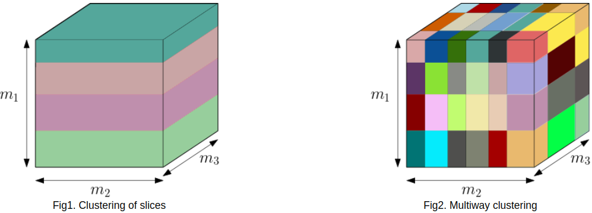

# Multiway Clustering of 3-order tensor via Affinity Matrix


This is the implementation of the Multiway Clustering of 3-order tensor via Affinity (MCAM) Matrix algorithm.


The MCAM find the multiway clustering for 3-order tensors based on the affinity (similarity) matrix. 

Each mode is treated independently of the others. The $(i,j)$ entries of the similarity matrix represent the similarity between slice $i$ and $j$ in this mode. We undertake the analysis of this affinity matrix using advanced clustering algorithms:

* Spectral Clustering
* Affinity Propagation 
* etc
    
The algorithms determine the clusters in each mode and the combination of all clusters of the three modes provides the multiway clustering (as illustrated in the figure below). 





Another benefit of the present method is its adaptability in two situations depending on whether the number of clusters is given as input or not. Hence, the users may choose among these two options. 

In addition, the MCAM is portable in the sense that one may choose any other matrix clustering algorithm to perform the clustering on its affinity matrix. 


We  compare its performance with three known algorithms of multiway clustering for tensorial data, namely Tucker+k-means, CP+k-means and TBM.

The experiment inside the paper is structured in 4 sections, 

#### 1 - MCAM for a rank-one tensor:
* 1.a - Effectiveness of MCAM with different value of signal strength for a rank-one tensor

```bash
python effectivessMCAM.py
```

#### 2 - First synthetical dataset : 
* 2.a - Comparison of the effectiveness of MCAM and the other algorithms for a n rank-one tensor
* 2.b - The ARI and NMI of MCAM for r varying from 1 to 10 and for $\gamma=55$
* 2.c - Performance of CP+k-means and Tucker+k-means with different rank of tensor decomposition

```bash
python first_data.py
```
#### 3 - Second synthetical dataset :
* 3.a - The ARI and NMI of the different algorithms (MCAM, CP+k-means, Tucker+k-means, TBM)
* 3.b - The ARI and NMI of MCAM for r varying from 1 to 10.

```bash
python second_data.py
```

#### 4 - Real dataset :
* 4.a - Application of MCAM and the other algorithms on a real dataset 

```bash
python real_data.py
```


[1] Andriantsiory, D.F., Ben Geloun, J., Lebbah, M.: Multiway Clustering of 3-order tensor via Affinity Matrix (2022)


```python

```
